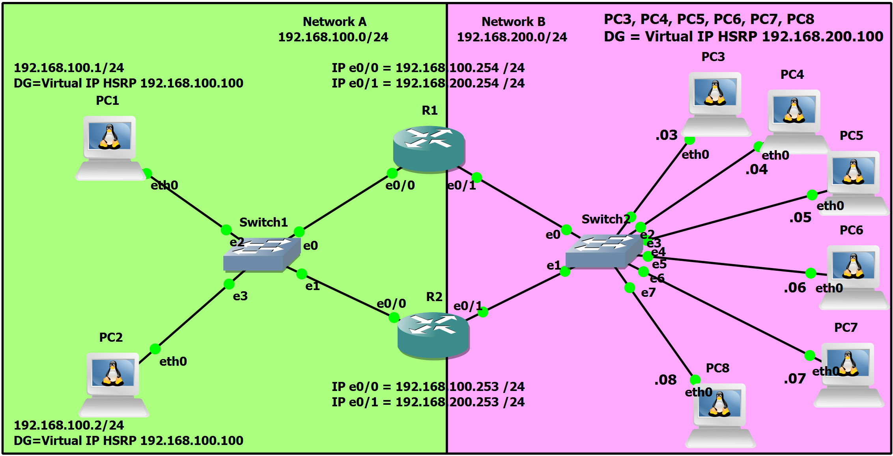

# FHRP - Hot Standby Router Protocol
High Availability Configuration with HSRP

To implement a first-hop gateway redundancy protocol (FHRP) solution using Cisco's Hot Standby Router Protocol (HSRP). The goal is to ensure that hosts on a subnet can maintain connectivity to external networks even if their default gateway router fails, thus eliminating a single point of failure (SPOF).

### Network Topology

The topology consists of two Local Area Networks (LANs) and two routers (R1 and R2) that provide mutual redundancy:

**Network A:** 192.168.100.0/24 
**Network B:** 192.168.200.0/24 
**Routers:** R1 and R2 are connected to both networks. 
**Virtual Gateway (HSRP):** 
  _Network A: 192.168.100.100 (HSRP Group 100) 
  _Network B: 192.168.200.100 (HSRP Group 200) 
